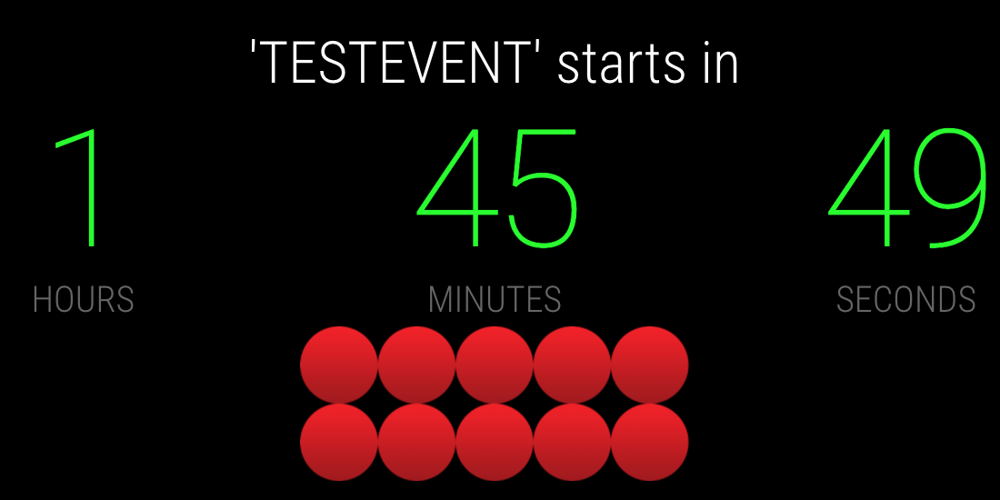
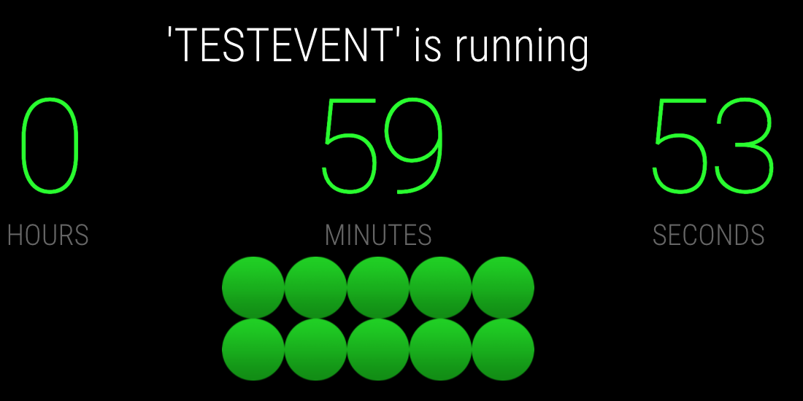

# MMM-EventCountdown

Countdown to the next calendar event for [MagicMirror²](https://github.com/MichMich/MagicMirror/).

The module includes a **server-side calendar fetcher** (`node_helper.js`) so calendar URLs never reach the browser.

## Screenshots




---

## Installation

```bash
cd ~/MagicMirror/modules
git clone https://github.com/ppjoern/MMM-EventCountdown.git
cd MMM-EventCountdown
npm install
```

---

## Configure calendar URLs

> **Do NOT put calendar URLs in module files** (`MMM-EventCountdown.js`, `node_helper.js`).
> Configure them in **two places** in the MagicMirror main config:

### Step 1: Add the secret URL to `config.env`

File: **`~/MagicMirror/config/config.env`**

```bash
# Google Calendar – private ICS URL (Google Calendar → Settings → Integrate calendar)
SECRET_CAL_URL_1="https://calendar.google.com/calendar/ical/your.email@gmail.com/private-abc123def456/basic.ics"

# Optional: another calendar
SECRET_CAL_URL_2="https://outlook.office365.com/owa/calendar/..."
```

> **Where to find the URL**
> - **Google Calendar:** Calendar → ⚙ Settings → select calendar → "Secret address in iCal format" → copy URL
> - **Outlook/Office365:** Calendar → Settings → Shared calendars → Publish → ICS link
>
> The URL contains a **secret token** – treat it like a password!

### Step 2: Add the module to `config.js`

File: **`~/MagicMirror/config/config.js`**

Root-level in `config.js` (once):

```js
let config = {
  hideConfigSecrets: true,
  // ...
  modules: [ /* … */ ],
};
```

Full module block (add to `modules: [ ... ]`):

```js
{
  module: "MMM-EventCountdown",
  position: "middle_center",

  config: {
    // --- Calendars (URLs in config.env, reference only here!) ---
    calendars: [
      {
        name: "My Calendar",
        url: "${SECRET_CAL_URL_1}",
        fetchTimeout: 30000,
      },
    ],
    allowedHosts: [],

    // --- Refresh ---
    fetchInterval: 60000,   // reload calendars (ms)
    customInterval: 1000,   // countdown tick (ms)

    // --- Display ---
    showLight: true,
    showColons: false,      // true = 05:23:45  |  false = 052345
    useUrgencyColors: true, // urgency colors by remaining time | false = always white

    size: "xlarge",         // small | medium | large | xlarge
    unitWidth: 2.8,         // width of each digit group (ch)
    groupGap: 0.5,          // gap between groups (ch)
    scale: 1,               // optional global size multiplier

    showDebugBorders: false, // layout debug frames (see below)

    // --- Labels ---
    daysLabel: "DAYS",
    hoursLabel: "HOURS",
    minutesLabel: "MINUTES",
    secondsLabel: "SECONDS",
    noEventText: "NO SCHEDULED EVENT!",
    runningText: "is running",
    startsInText: "starts in",
  },
},
```

> The same template is available as `config.example.js` in the module folder.

Minimal example:

```js
{
  module: "MMM-EventCountdown",
  position: "middle_center",
  config: {
    calendars: [{ name: "My Calendar", url: "${SECRET_CAL_URL_1}" }],
    size: "xlarge",
    showColons: false,
    showLight: true,
  },
},
```

### Summary: where things go

| What | Where | Example |
|------|-------|---------|
| **Real calendar URL** (secret) | `~/MagicMirror/config/config.env` | `SECRET_CAL_URL_1="https://calendar.google.com/..."` |
| **Reference to the URL** | `~/MagicMirror/config/config.js` → `calendars[].url` | `url: "${SECRET_CAL_URL_1}"` |
| **Enable secret protection** | `~/MagicMirror/config/config.js` (root level) | `hideConfigSecrets: true` |
| **Module code** | `modules/MMM-EventCountdown/` | ❌ Do not put URLs here! |

### Security notes

1. Set **`hideConfigSecrets: true`** – prevents URLs from appearing in the browser (`/config`).
2. Use the **`SECRET_` prefix** for all calendar URLs in `config.env`.
3. Set **`ipWhitelist`** in `config.js` so only trusted devices can access the mirror:
   ```js
   ipWhitelist: ["127.0.0.1", "::ffff:127.0.0.1", "::1", "192.168.1.0/24"],
   ```
4. The `node_helper` fetches calendars **server-side only** – the URL never reaches the browser.
5. Only known calendar domains are allowed (SSRF protection). Allow custom servers via `allowedHosts`:
   ```js
   allowedHosts: ["my-calendar.example.com"],
   ```

---

## Configuration options

### Calendar & security

| Option | Description | Default |
|--------|-------------|---------|
| `calendars` | Array of `{ name, url, fetchTimeout? }` | `[]` |
| `calendars[].name` | Display name (logs only) | – |
| `calendars[].url` | Env reference, e.g. `"${SECRET_CAL_URL_1}"` | – |
| `calendars[].fetchTimeout` | Timeout per calendar fetch (ms) | `30000` |
| `allowedHosts` | Additional allowed domains (SSRF whitelist) | `[]` |
| `fetchInterval` | Calendar reload interval (ms) | `60000` |
| `customInterval` | Countdown update interval (ms) | `1000` |

### Display

| Option | Description | Default |
|--------|-------------|---------|
| `size` | Size preset: `small`, `medium`, `large`, `xlarge` | `"medium"` |
| `unitWidth` | Width of each digit group in `ch` | `2.8` |
| `groupGap` | Gap between digit groups in `ch` | `0.5` |
| `showColons` | Colons between groups (`05:23:45`) | `false` |
| `showLight` | Traffic-light graphic below the countdown | `false` |
| `useUrgencyColors` | Colors by remaining time (green → orange) | `true` |
| `valueSize` | Fixed font size (e.g. `"12rem"`) – single display only | `null` |

### Scaling (optional)

| Option | Description | Default |
|--------|-------------|---------|
| `scale` | Global multiplier on the CSS clamp size | `1` |

Base size comes from **CSS `clamp(vmin)`** and adapts per browser automatically. `scale` is for fine-tuning only.

| Preset | CSS formula (digit height) |
|--------|----------------------------|
| `small` | `clamp(4vmin, 8vmin, 15vmin)` |
| `medium` | `clamp(5vmin, 11vmin, 20vmin)` |
| `large` | `clamp(6vmin, 13vmin, 26vmin)` |
| `xlarge` | `clamp(8vmin, 17vmin, 34vmin)` |

### Text labels

| Option | Description | Default |
|--------|-------------|---------|
| `daysLabel` | Days label | `"DAYS"` |
| `hoursLabel` | Hours label | `"HOURS"` |
| `minutesLabel` | Minutes label | `"MINUTES"` |
| `secondsLabel` | Seconds label | `"SECONDS"` |
| `noEventText` | Text when no event is found | `"NO SCHEDULED EVENT!"` |
| `runningText` | Text while event is running | `"is running"` |
| `startsInText` | Text before event starts | `"starts in"` |

### Debug

| Option | Description | Default |
|--------|-------------|---------|
| `showDebugBorders` | Colored outlines around layout cells | `false` |

Alternatives without editing `config.js`:

- URL: `http://<mirror-ip>:8080/?debugBorders=1`
- Browser console: `localStorage.setItem("MMM-EventCountdown-debug","1"); location.reload();`

---

## Fine-tuning tips

### Size

```js
size: "xlarge",   // main control – scales with viewport (vmin)
```

### Spacing between digit groups

```js
groupGap: 0.5,    // smaller = tighter  |  larger = wider
unitWidth: 2.8,   // column width per group (2 digits + padding)
```

With `showColons: true`, the colon sits **inside** the `groupGap` width – spacing is not doubled.

### Mixed displays (browser + HDMI)

One `config.js` for all clients. Each browser calculates size from its own viewport:

```js
size: "xlarge",
scale: 1,         // optional fine-tuning if needed
```

### Colors

- `useUrgencyColors: true` – countdown digits change by remaining time; running events are green
- Title and subtitle ("starts in" / "is running") are always white
- With `showColons: true`, colons use the same color as the digits

---

## Architecture

```
config.env (SECRET_CAL_URL_1)  ──┐
config.js  (calendars[].url)   ──┤
                                   ▼
                          node_helper.js  (server, Node.js)
                          ├── resolve URL from process.env
                          ├── fetch ICS feed (HTTPS only)
                          ├── check SSRF whitelist
                          └── parse events (node-ical)
                                   │
                          Socket: "EVENTS"
                                   ▼
                          MMM-EventCountdown.js  (browser)
                          ├── filter next event
                          ├── compute countdown
                          └── build DOM safely (textContent)
```

---

## License

MIT
