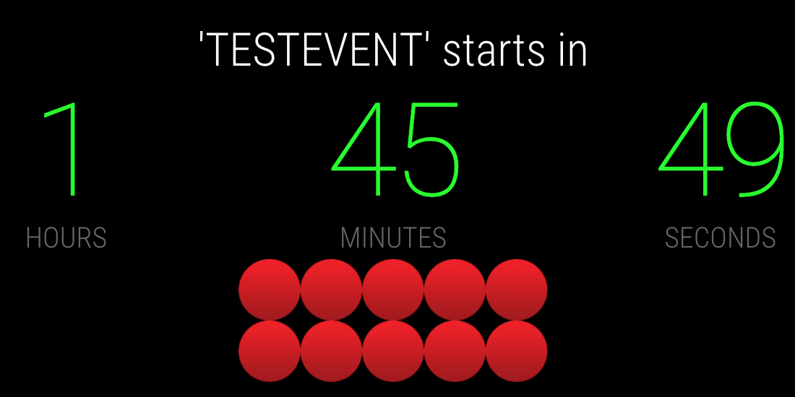
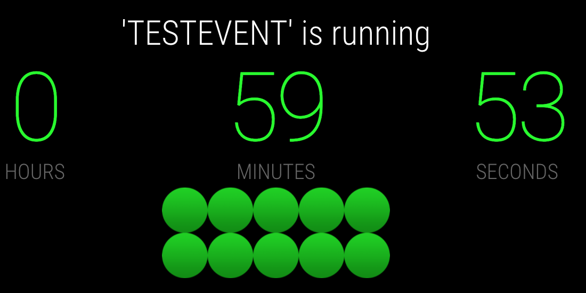

# MMM-EventCountdown

Countdown zum nächsten Kalendertermin für [MagicMirror²](https://github.com/MichMich/MagicMirror/).

Das Modul holt Kalenderdaten **serverseitig** über einen `node_helper` – die privaten Kalender-URLs landen nie im Browser.




---

## Was macht das Modul?

- Liest ICS-Kalender (Google, Outlook, Yahoo, iCloud) ein
- Zeigt den **nächsten Termin** mit Countdown an (Tage/Stunden/Minuten oder Stunden/Minuten/Sekunden)
- Erkennt **laufende Termine** („is running“ / „läuft gerade“)
- Optionale **Ampel-Grafik** unter dem Countdown
- **Dringlichkeitsfarben** je nach verbleibender Zeit (grün → orange)
- Responsive Größe per CSS `clamp(vmin)` – passt sich dem Display an

---

## Installation auf dem Raspberry Pi

### Voraussetzungen

| Voraussetzung | Hinweis |
|---------------|---------|
| Raspberry Pi (3/4/5 empfohlen) | MagicMirror² läuft auch auf Pi Zero, ist aber langsamer |
| MagicMirror² installiert | Offizielle Anleitung: [MagicMirror Installation](https://docs.magicmirror.builders/getting-started/installation.html) |
| Node.js ≥ 18 | Wird mit MagicMirror mitgeliefert; prüfen mit `node -v` |
| Internetzugang | Kalender werden per HTTPS abgerufen |
| Kalender-ICS-URL | Geheimer Link aus Google/iCloud/Outlook (siehe unten) |

> **Hinweis:** Falls MagicMirror noch nicht installiert ist, zuerst die [offizielle Pi-Installation](https://docs.magicmirror.builders/getting-started/installation.html) durchführen. Danach dieses Modul ergänzen.

### Schritt 1: Modul herunterladen

Per SSH auf den Pi verbinden und das Modul klonen:

```bash
cd ~/MagicMirror/modules
git clone https://github.com/ppjoern/MMM-EventCountdown.git
cd MMM-EventCountdown
npm install
```

`npm install` installiert die Abhängigkeit `node-ical` zum Parsen der ICS-Dateien.

### Schritt 2: Kalender-URL sicher hinterlegen

**Kalender-URLs gehören nicht in den Modul-Code**, sondern in die MagicMirror-Konfiguration.

#### 2a) Geheime URL in `config.env` eintragen

Datei: **`~/MagicMirror/config/config.env`**

Falls die Datei noch nicht existiert, anlegen:

```bash
nano ~/MagicMirror/config/config.env
```

Inhalt (Beispiel):

```bash
# Google Kalender – private ICS-URL
# Google Kalender → ⚙ Einstellungen → Kalender auswählen → „Geheime Adresse im iCal-Format“
SECRET_CAL_URL_1="https://calendar.google.com/calendar/ical/deine.email@gmail.com/private-abc123def456/basic.ics"

# Optional: zweiter Kalender (z. B. iCloud)
SECRET_CAL_URL_2="https://pXX-caldav.icloud.com/published/2/..."
```

**Wo finde ich die URL?**

| Anbieter | Pfad zur ICS-URL |
|----------|------------------|
| **Google Kalender** | Kalender → ⚙ Einstellungen → Kalender wählen → „Geheime Adresse im iCal-Format“ |
| **Outlook / Office 365** | Kalender → Einstellungen → Geteilte Kalender → Veröffentlichen → ICS-Link |
| **Apple iCloud** | Kalender-App → Kalender teilen → Öffentlicher Kalender → Link kopieren (Host: `pXX-caldav.icloud.com`) |

> Die URL enthält ein **Geheim-Token** – wie ein Passwort behandeln!

#### 2b) Modul in `config.js` eintragen

Datei: **`~/MagicMirror/config/config.js`**

Am **Root-Level** von `config.js` (einmalig):

```js
let config = {
  hideConfigSecrets: true,   // URLs nicht im Browser sichtbar machen
  // ...
  modules: [ /* … */ ],
};
```

Modul-Block in das `modules`-Array einfügen:

```js
{
  module: "MMM-EventCountdown",
  position: "middle_center",

  config: {
    calendars: [
      {
        name: "Mein Kalender",
        url: "${SECRET_CAL_URL_1}",
        fetchTimeout: 30000,
      },
    ],
    allowedHosts: [],

    fetchInterval: 60000,   // Kalender neu laden (ms)
    customInterval: 1000,   // Countdown-Tick (ms)

    showLight: true,
    showColons: false,      // true = 05:23:45  |  false = 052345
    useUrgencyColors: true,

    size: "xlarge",         // small | medium | large | xlarge
    unitWidth: 2.8,
    groupGap: 0.5,
    scale: 1,

    daysLabel: "TAGE",
    hoursLabel: "STUNDEN",
    minutesLabel: "MINUTEN",
    secondsLabel: "SEKUNDEN",
    noEventText: "KEIN TERMIN GEPLANT!",
    runningText: "läuft gerade",
    startsInText: "beginnt in",
  },
},
```

> Eine vollständige Vorlage liegt als `config.example.js` im Modul-Ordner.

**Minimal-Konfiguration:**

```js
{
  module: "MMM-EventCountdown",
  position: "middle_center",
  config: {
    calendars: [{ name: "Mein Kalender", url: "${SECRET_CAL_URL_1}" }],
    size: "xlarge",
    showLight: true,
  },
},
```

### Schritt 3: MagicMirror neu starten

```bash
# Wenn MagicMirror als systemd-Dienst läuft:
sudo systemctl restart MagicMirror

# Oder manuell:
cd ~/MagicMirror
npm run start
```

Beim Start sollte in den Logs erscheinen:

```
[MMM-EventCountdown] node_helper started – calendar fetch runs server-side.
```

Logs prüfen:

```bash
# systemd:
journalctl -u MagicMirror -f

# oder in ~/MagicMirror/logs/
```

### Schritt 4: Im Browser testen

MagicMirror im Browser öffnen (Standard: `http://<pi-ip>:8080`).

- Countdown sichtbar → alles ok
- „KEIN TERMIN GEPLANT!“ → Kalender leer, URL falsch, oder nur Ganztages-Termine vorhanden
- Modul fehlt komplett → `config.js` prüfen, MagicMirror neu starten

---

## Übersicht: Wo gehört was hin?

| Was | Wo | Beispiel |
|-----|----|----------|
| **Echte Kalender-URL** (Geheimnis) | `~/MagicMirror/config/config.env` | `SECRET_CAL_URL_1="https://calendar.google.com/..."` |
| **Referenz auf die URL** | `~/MagicMirror/config/config.js` → `calendars[].url` | `url: "${SECRET_CAL_URL_1}"` |
| **Secret-Schutz aktivieren** | `~/MagicMirror/config/config.js` (Root) | `hideConfigSecrets: true` |
| **Modul-Code** | `modules/MMM-EventCountdown/` | ❌ Keine URLs hier eintragen! |

---

## Konfigurationsoptionen

### Kalender & Sicherheit

| Option | Beschreibung | Standard |
|--------|--------------|----------|
| `calendars` | Array aus `{ name, url, fetchTimeout? }` | `[]` |
| `calendars[].name` | Anzeigename (nur Logs) | – |
| `calendars[].url` | Env-Referenz, z. B. `"${SECRET_CAL_URL_1}"` | – |
| `calendars[].fetchTimeout` | Timeout pro Kalender-Abruf (ms) | `30000` |
| `allowedHosts` | Zusätzliche erlaubte Domains (SSRF-Schutz) | `[]` |
| `fetchInterval` | Kalender-Neulade-Intervall (ms) | `60000` |
| `customInterval` | Countdown-Aktualisierung (ms) | `1000` |

### Anzeige

| Option | Beschreibung | Standard |
|--------|--------------|----------|
| `size` | Größe: `small`, `medium`, `large`, `xlarge` | `"medium"` |
| `unitWidth` | Spaltenbreite pro Zifferngruppe (`ch`) | `2.8` |
| `groupGap` | Abstand zwischen Gruppen (`ch`) | `0.5` |
| `showColons` | Doppelpunkte zwischen Gruppen | `false` |
| `showLight` | Ampel-Grafik unter dem Countdown | `false` |
| `useUrgencyColors` | Farben nach verbleibender Zeit | `true` |
| `scale` | Globaler Größen-Multiplikator | `1` |

### Größen-Presets

| Preset | CSS-Formel (Ziffernhöhe) |
|--------|--------------------------|
| `small` | `clamp(4vmin, 8vmin, 15vmin)` |
| `medium` | `clamp(5vmin, 11vmin, 20vmin)` |
| `large` | `clamp(6vmin, 13vmin, 26vmin)` |
| `xlarge` | `clamp(8vmin, 17vmin, 34vmin)` |

### Texte (Labels)

| Option | Standard |
|--------|----------|
| `daysLabel` | `"DAYS"` |
| `hoursLabel` | `"HOURS"` |
| `minutesLabel` | `"MINUTES"` |
| `secondsLabel` | `"SECONDS"` |
| `noEventText` | `"NO SCHEDULED EVENT!"` |
| `runningText` | `"is running"` |
| `startsInText` | `"starts in"` |

Alle Texte sind frei anpassbar – z. B. auf Deutsch (siehe Beispiel oben).

---

## Fehlerbehebung auf dem Pi

### „Could not resolve URL for calendar …"

- `config.env` existiert und enthält `SECRET_CAL_URL_1=...`?
- Variable in `config.js` exakt so referenziert: `"${SECRET_CAL_URL_1}"`?
- MagicMirror nach Änderungen neu gestartet?

### „Host … is not in the allowedHosts whitelist"

Der Kalender-Host ist nicht in der Whitelist. Standardmäßig erlaubt:

- `calendar.google.com`, `outlook.office365.com`, `outlook.live.com`
- `calendar.yahoo.com`, `*.icloud.com`

Eigene Server ergänzen:

```js
allowedHosts: ["mein-kalender.example.com"],
```

### „HTTP 403/404 while fetching calendar"

- ICS-URL im Browser testen (am PC, nicht am Spiegel!)
- Bei Google: „Geheime Adresse“ neu generieren, falls widerrufen
- Bei iCloud: Kalender muss als „öffentlich“ geteilt sein

### „NO SCHEDULED EVENT!" / „KEIN TERMIN GEPLANT!"

- Nur **Termine mit Uhrzeit** werden gezählt (Ganztages-Events werden übersprungen)
- Termine, die vor mehr als 24 h geendet sind, werden ignoriert
- Kalender wirklich Termine in der Zukunft?

### Modul lädt nicht / npm-Fehler

```bash
cd ~/MagicMirror/modules/MMM-EventCountdown
rm -rf node_modules
npm install
```

Node-Version prüfen (≥ 18 empfohlen):

```bash
node -v
```

### Performance auf älteren Pis

- `fetchInterval` erhöhen (z. B. `120000` = alle 2 Minuten)
- Nur einen Kalender einbinden
- `size: "large"` statt `"xlarge"` verwenden

---

## Sicherheit

1. **`hideConfigSecrets: true`** setzen – verhindert, dass URLs im Browser unter `/config` sichtbar sind
2. **`SECRET_`-Präfix** für alle Kalender-URLs in `config.env` verwenden
3. **`ipWhitelist`** in `config.js` einschränken:
   ```js
   ipWhitelist: ["127.0.0.1", "::ffff:127.0.0.1", "::1", "192.168.1.0/24"],
   ```
4. Kalender-Abruf läuft **nur serverseitig** – die URL erreicht nie den Browser
5. SSRF-Schutz: Nur bekannte Kalender-Domains + `allowedHosts` sind erlaubt

---

## Architektur

```
config.env (SECRET_CAL_URL_1)  ──┐
config.js  (calendars[].url)   ──┤
                                   ▼
                          node_helper.js  (Server, Node.js)
                          ├── URL aus process.env auflösen
                          ├── ICS-Feed abrufen (HTTPS)
                          ├── SSRF-Whitelist prüfen
                          └── Termine parsen (node-ical)
                                   │
                          Socket: "EVENTS"
                                   ▼
                          MMM-EventCountdown.js  (Browser)
                          ├── nächsten Termin filtern
                          ├── Countdown berechnen
                          └── DOM sicher aufbauen (textContent)
```

---

## Modul aktualisieren

```bash
cd ~/MagicMirror/modules/MMM-EventCountdown
git pull
npm install
sudo systemctl restart MagicMirror
```

---

## Lizenz

MIT
